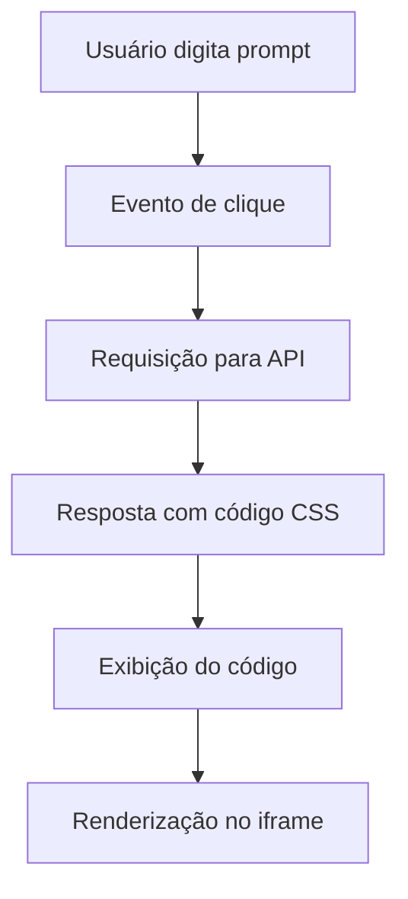

# 🚀 CSS Generator com Inteligência Artificial

---

## 📌 Visão Geral

Aplicação web que utiliza **Inteligência Artificial** para transformar descrições em linguagem natural em **código CSS funcional**, com **preview em tempo real**.

> 💡 Exemplo:
> `"bola azul pingando"` → código CSS + renderização automática
> 


Este projeto demonstra, na prática, como integrar IA ao fluxo de desenvolvimento front-end para aumentar produtividade e acelerar a prototipação de interfaces.

---

## 🧠 Motivação

Este projeto foi desenvolvido com foco em:

* Aplicação real de IA no desenvolvimento web
* Automação de geração de código
* Exploração de **Prompt Engineering**
* Integração com APIs modernas
* Construção de projetos com foco em portfólio

---

## ⚙️ Funcionalidades

✔️ Geração automática de CSS via IA
✔️ Input em linguagem natural
✔️ Preview em tempo real (iframe)
✔️ Interface simples e intuitiva
✔️ Atualização dinâmica do DOM

---

## 🛠️ Tecnologias Utilizadas

---

## 🧱 Estrutura do Projeto

```bash
/project
│── index.html      # Estrutura da interface
│── styles.css      # Estilização
│── scripts.js      # Lógica + integração com API
```

---

## 🔄 Fluxo da Aplicação



---

## 🔌 Integração com API

A aplicação consome uma API de IA responsável por:

* Interpretar o prompt
* Gerar código CSS dinâmico
* Retornar o resultado estruturado

### Responsabilidades no código:

* Construção da requisição (fetch/async-await)
* Tratamento de resposta
* Manipulação do DOM
* Renderização dinâmica

---

## 🎯 Competências Demonstradas

* Front-End Development
* JavaScript (ES6+)
* Consumo de APIs REST
* Manipulação de DOM
* Prompt Engineering
* UX/UI básico
* Debug e troubleshooting

---

## 📈 Roadmap

* [ ] Histórico de prompts
* [ ] Suporte a JavaScript dinâmico
* [ ] Melhor tratamento de erros
* [ ] UI/UX aprimorada
* [ ] Deploy online
* [ ] Arquitetura modular

---

## 🚀 Como Executar

```bash
# Clone o repositório
git clone <url-do-repositorio>

# Acesse a pasta
cd nome-do-projeto

# Abra no navegador
index.html
```

> ⚠️ Configure sua API Key no arquivo `scripts.js`

---

## 📸 Preview do Projeto

> *(adicione aqui um print ou gif do projeto rodando)*

---

## 🤝 Contribuição

Contribuições são bem-vindas!

1. Fork o projeto
2. Crie uma branch (`feature/minha-feature`)
3. Commit suas alterações
4. Push para a branch
5. Abra um Pull Request

---

## 📄 Licença

Este projeto está sob a licença MIT.

---

## 💼 Autor

Desenvolvido por você 👨‍💻
📬 Aberto a oportunidades na área de desenvolvimento Front-End

---

## ⭐ Apoie o projeto

Se esse projeto te ajudou ou achou interessante:

👉 Deixe uma estrela no repositório
👉 Compartilhe com outros devs

---
